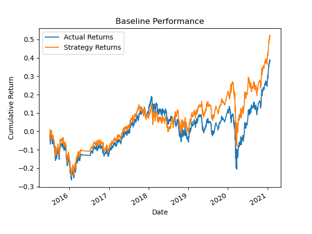
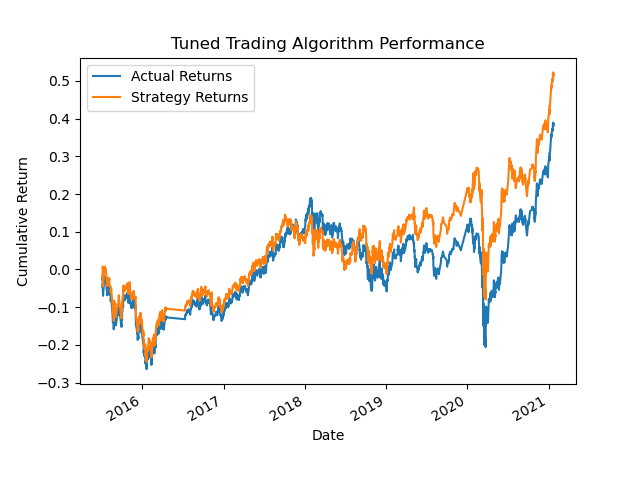
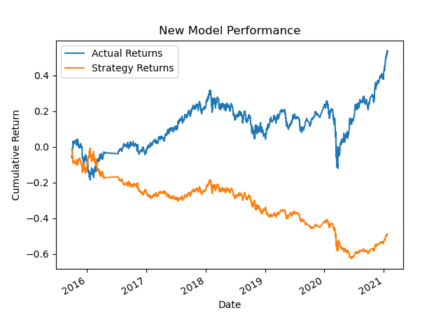

# Machine Learning Trading Bot Evaluation Report
This repository contains code for a machine learning trading bot that aims to improve the performance of an algorithmic trading system using various techniques. The trading bot incorporates machine learning algorithms to adapt to new data and make predictions on future market trends.

## Overview
The trading bot project involves the following steps:

- Establish a Baseline Performance
- Tune the Baseline Trading Algorithm
- Evaluate a New Machine Learning Classifier

## Step 1: Establish a Baseline Performance
In this step, we used the provided starter code to establish a baseline performance for the trading algorithm. We imported the OHLCV dataset into a Pandas DataFrame, generated trading signals using short- and long-window simple moving averages (SMA), and split the data into training and testing datasets. We then trained a Support Vector Machine (SVM) classifier from SKLearn using the training data and made predictions on the testing data.

### Results
The baseline trading algorithm achieved an accuracy of approximately 54%. However, the algorithm struggled to predict negative returns accurately. We analyzed the classification report and created a cumulative return graph to compare the actual returns with the strategy returns.

## Step 2: Tune the Baseline Trading Algorithm
In this step, we aimed to improve the performance of the baseline trading algorithm by tuning its parameters. We experimented with adjusting the size of the training dataset and the SMA input features to find the optimal values.

### Results
By varying the training window size and the SMA windows, we observed changes in the algorithm's performance. Increasing the training window improved the algorithm's ability to predict negative returns, while adjusting the SMA windows influenced precision and recall scores.

## Step 3: Evaluate a New Machine Learning Classifier
In this step, we evaluated the performance of a new machine learning classifier, specifically the AdaBoost classifier. We used the original parameters from the starter code and trained the AdaBoost model. We then backtested the model and compared its performance with the baseline trading algorithm and the tuned trading algorithm.

### Results
The AdaBoost classifier performed slightly better than the baseline model in terms of precision, recall, and F1-scores for both classes. However, it did not outperform the tuned trading algorithm, which achieved the highest F1-scores overall.

## Conclusion
Based on the analysis conducted, the tuned trading algorithm with optimized parameter settings showed the best performance among the models evaluated. It achieved improved precision, recall, and F1-scores for both positive and negative classes. However, it is important to note that these findings are based on the specific dataset and time period used in the analysis.
